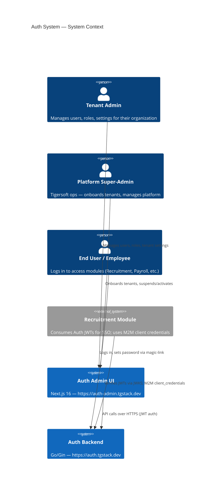
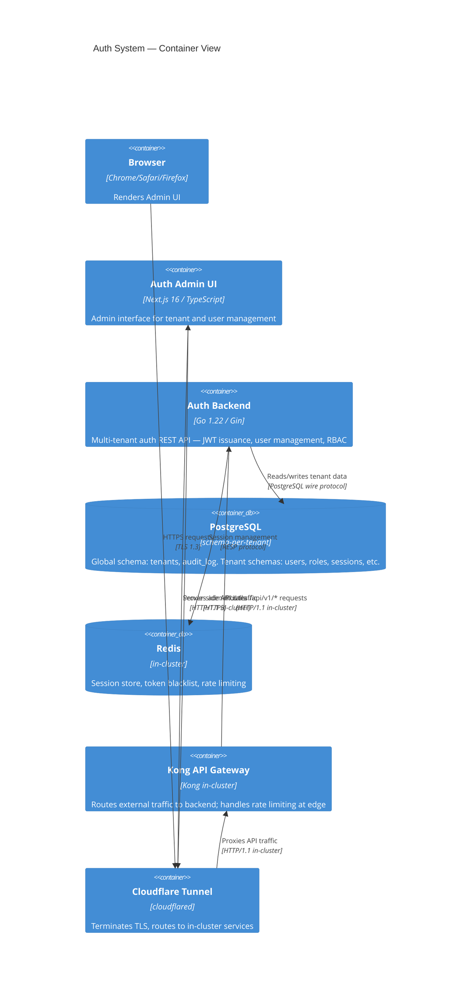
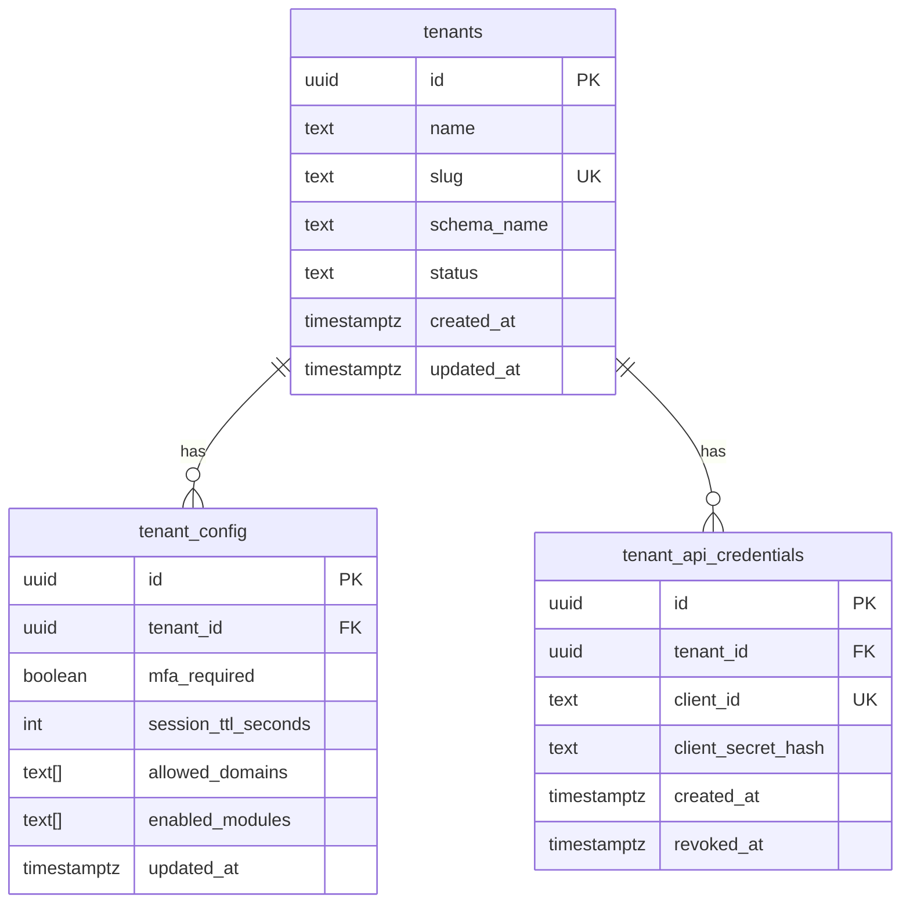
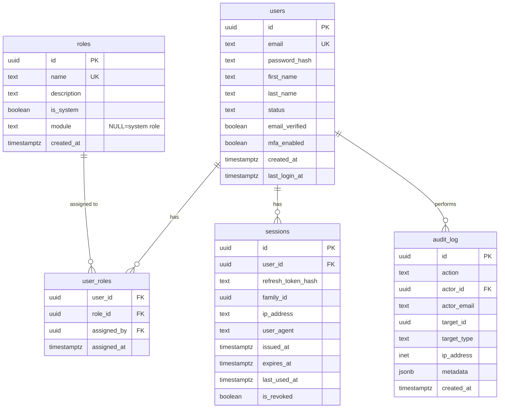

# Solution Architecture
## Auth Admin UI v2 — Backend Integration

**Version:** 1.0
**Date:** 2026-03-04
**Status:** Approved
**Author:** Solution Architect Agent
**Source PRD:** `/docs/auth-admin-ui-v2/prd.md`

---

## 1. Architecture Assessment

### Current State

The system consists of two independently developed services:

| Component | Location | Status |
|-----------|----------|--------|
| Auth Backend | `auth-system/backend` (Go/Gin) | Running on EKS at `auth.tgstack.dev` |
| Auth Admin UI | `auth-admin-ui` (Next.js) | Running on EKS at `auth-admin.tgstack.dev` |

### Identified Defects by Category

| Category | Severity | Count | Description |
|----------|----------|-------|-------------|
| JWT claims | Critical | 2 | `tenant_id` uses UUID instead of slug; refresh sets empty `tenant_id` |
| HTTP semantics | High | 3 | State transitions using PUT instead of POST; incorrect status codes |
| Field naming | High | 8 | `user_id`, `tenant_id`, `role_id` in responses; audit log field mismatches |
| Pagination | High | 3 | `limit`/`offset` in all list endpoints instead of `page`/`page_size` |
| Error format | High | Multiple | Inconsistent error shapes across handlers |
| Missing endpoints | High | 6 | GET user by ID, PUT roles, POST enable, GET/PUT tenant settings, POST activate |
| Schema exposure | Medium | 1 | `schema_name` exposed in tenant responses |
| Frontend URL | High | 1 | Refresh token calls wrong endpoint URL |
| Frontend error parsing | High | 1 | `err.message` doesn't match `{ error: { code, message } }` shape |
| Frontend headers | Medium | 1 | `X-Tenant-ID` sent on authenticated requests |
| TypeScript types | Medium | 5 | Interfaces don't match current API shapes |
| DB schema | High | 1 | `roles` table missing `module` column |

### Risk Assessment

| Risk | Probability | Impact | Level | Mitigation |
|------|-------------|--------|-------|------------|
| Migration 000017 breaks existing roles data | Medium | High | High | Additive migration only: add nullable `module` column with default null |
| JWT change breaks Recruitment backend | Low | Critical | High | JWKS unchanged; only `tenant_id` value changes (UUID→slug) — Recruitment was designed to use slug |
| Frontend type errors block build | High | Medium | Medium | Fix types first in Sprint 1 before component changes |
| Circular dependency in role assignment refactor | Low | Medium | Low | Keep existing AssignRole; add new ReplaceRoles as separate method |

No unresolved High-severity architectural risks after applying mitigations above. Gate passes.

---

## 2. System Design

### 2.1 Architecture Pattern

The system follows **Clean / Hexagonal Architecture** with clear layer separation:

```
Handler (HTTP) → Service (Business Logic) → Repository (Data Access) → PostgreSQL / Redis
```

No changes to the architectural pattern are required. All modifications are **within existing layers**, correcting contract mismatches at the handler and service layers, and adding missing endpoints.

### 2.2 Data Flow

```
Browser (auth-admin.tgstack.dev)
  └─ Cloudflare Tunnel
       └─ auth-admin-ui.henderson.svc.cluster.local:3000 (Next.js)
            └─ [API calls] → auth.tgstack.dev
                               └─ Cloudflare Tunnel
                                    └─ Kong proxy (kong namespace)
                                         └─ auth-system.henderson.svc.cluster.local:8080 (Go/Gin)
                                              ├─ PostgreSQL: central-postgres.database.svc.cluster.local:5432
                                              └─ Redis: my-redis-master.redis.svc.cluster.local:6379
```

### 2.3 Multi-Tenant Schema Resolution

```
Request: POST /api/v1/auth/login
  Header: X-Tenant-ID: henderson
  Body: { email, password }
  ↓
Middleware: ResolveTenant(slug) → queries global.tenants WHERE slug=? → sets schema in context
  ↓
Handler: calls service with tenant context
  ↓
Repository: SET search_path TO tenant_henderson
  ↓
JWT issued: { tenant_id: "henderson" }  ← slug, not UUID
```

For authenticated requests (after login), tenant is resolved from JWT claim `tenant_id` (slug). `X-Tenant-ID` header is no longer required or trusted.

---

## 3. C4 Diagrams

### 3.1 C4 Context Diagram



### 3.2 C4 Container Diagram



---

## 4. Database Schema — ERD

### 4.1 Existing Schema (Global)



### 4.2 Existing Per-Tenant Schema



### 4.3 New Migration — 000017_add_module_to_roles

```sql
-- migrations/tenant/000017_add_module_to_roles.up.sql
ALTER TABLE roles ADD COLUMN IF NOT EXISTS module TEXT DEFAULT NULL;
CREATE INDEX IF NOT EXISTS idx_roles_module ON roles (module);

-- Down migration
-- migrations/tenant/000017_add_module_to_roles.down.sql
ALTER TABLE roles DROP COLUMN IF EXISTS module;
```

### 4.4 New Migration — 000018_seed_module_roles

```sql
-- migrations/tenant/000018_seed_module_roles.up.sql
-- Seed module roles for all known modules.
-- These are seeded on existing tenants during migration.
INSERT INTO roles (name, description, is_system, module) VALUES
  ('recruiter',       'Recruitment module — creates job postings, reviews applications', true, 'recruit'),
  ('hiring_manager',  'Recruitment module — approves/rejects candidates', true, 'recruit'),
  ('interviewer',     'Recruitment module — conducts and records interviews', true, 'recruit'),
  ('payroll_manager', 'Payroll module — manages payroll runs', true, 'payroll'),
  ('payroll_approver','Payroll module — approves payroll runs', true, 'payroll'),
  ('payroll_viewer',  'Payroll module — read-only access to payroll data', true, 'payroll'),
  ('time_manager',    'Time module — manages time tracking settings', true, 'time'),
  ('time_approver',   'Time module — approves timesheets', true, 'time'),
  ('time_employee',   'Time module — submits timesheets', true, 'time')
ON CONFLICT (name) DO NOTHING;
```

---

## 5. API Contract (Single Source of Truth)

This contract is final and locked. Frontend and backend developers implement against this contract simultaneously.

### 5.1 Endpoint Summary

| Method | Path | Auth | Role Required | Description |
|--------|------|------|--------------|-------------|
| POST | /api/v1/auth/login | None | — | Login |
| POST | /api/v1/auth/token/refresh | None | — | Refresh tokens |
| POST | /api/v1/auth/logout | Bearer | — | Logout |
| GET | /api/v1/admin/users | Bearer | admin | List users |
| GET | /api/v1/admin/users/:id | Bearer | admin | Get user by ID [NEW] |
| POST | /api/v1/admin/users/invite | Bearer | admin | Invite user |
| PUT | /api/v1/admin/users/:id/roles | Bearer | admin | Replace user roles [NEW] |
| POST | /api/v1/admin/users/:id/disable | Bearer | admin | Disable user [method fix] |
| POST | /api/v1/admin/users/:id/enable | Bearer | admin | Enable user [NEW] |
| GET | /api/v1/admin/roles | Bearer | admin | List roles |
| POST | /api/v1/admin/roles | Bearer | admin | Create role |
| DELETE | /api/v1/admin/roles/:id | Bearer | admin | Delete role |
| GET | /api/v1/admin/tenant | Bearer | admin | Get tenant settings [NEW] |
| PUT | /api/v1/admin/tenant | Bearer | admin | Update tenant settings [expanded] |
| GET | /api/v1/admin/audit-log | Bearer | admin | List audit log |
| GET | /api/v1/admin/tenants | Bearer | super_admin | List all tenants |
| GET | /api/v1/admin/tenants/:id | Bearer | super_admin | Get tenant by ID |
| POST | /api/v1/admin/tenants | Bearer | super_admin | Create tenant |
| POST | /api/v1/admin/tenants/:id/suspend | Bearer | super_admin | Suspend tenant [method fix] |
| POST | /api/v1/admin/tenants/:id/activate | Bearer | super_admin | Activate tenant [NEW] |
| POST | /api/v1/admin/tenants/:id/credentials | Bearer | super_admin | Generate M2M credentials |
| POST | /api/v1/admin/tenants/:id/credentials/rotate | Bearer | super_admin | Rotate M2M credentials |

### 5.2 Auth Endpoints

#### POST /api/v1/auth/login

```
Request Headers:
  Content-Type: application/json
  X-Tenant-ID: {slug}  ← required, used to resolve tenant before JWT exists

Request Body:
  {
    "email": "string (required, email format)",
    "password": "string (required, min 8 chars)",
    "totp_code": "string (optional, 6-digit TOTP)"
  }

Success 200:
  {
    "access_token": "string (JWT RS256)",
    "refresh_token": "string (opaque)",
    "expires_in": 900,
    "refresh_expires_in": 604800
  }

JWT Payload (access_token):
  {
    "sub": "550e8400-e29b-41d4-a716-446655440000",
    "email": "admin@henderson.co.th",
    "tenant_id": "henderson",   ← SLUG, not UUID
    "roles": ["user", "admin"],
    "module_roles": {
      "recruit": ["recruiter"]
    },
    "exp": 1740000000,
    "iat": 1739999100,
    "iss": "tigersoft-auth"
  }

Errors:
  400 { "error": { "code": "validation_error", "message": "email is required" } }
  401 { "error": { "code": "invalid_credentials", "message": "Invalid email or password" } }
  401 { "error": { "code": "mfa_required", "message": "TOTP code required" } }
  401 { "error": { "code": "invalid_totp", "message": "Invalid TOTP code" } }
  403 { "error": { "code": "tenant_suspended", "message": "This tenant has been suspended" } }
  403 { "error": { "code": "user_inactive", "message": "Account is disabled" } }
  404 { "error": { "code": "tenant_not_found", "message": "Tenant not found" } }
  429 { "error": { "code": "rate_limit_exceeded", "message": "Too many login attempts" } }
```

#### POST /api/v1/auth/token/refresh

```
Request Body:
  { "refresh_token": "string (required)" }

Success 200:
  {
    "access_token": "string (JWT RS256)",
    "refresh_token": "string (new opaque token)",
    "expires_in": 900
  }

Errors:
  400 { "error": { "code": "validation_error", "message": "refresh_token is required" } }
  401 { "error": { "code": "invalid_token", "message": "Refresh token is invalid or expired" } }
```

#### POST /api/v1/auth/logout

```
Request Headers:
  Authorization: Bearer {access_token}

Request Body:
  { "refresh_token": "string (required)" }

Success 204: (no body)

Errors:
  401 { "error": { "code": "unauthorized", "message": "Authentication required" } }
```

### 5.3 User Management Endpoints

#### GET /api/v1/admin/users

```
Request Headers:
  Authorization: Bearer {access_token}   ← tenant resolved from JWT, no X-Tenant-ID needed

Query Parameters:
  page       integer (default: 1, min: 1)
  page_size  integer (default: 20, min: 1, max: 100)
  status     string  (optional: "active" | "inactive" | "pending")
  module     string  (optional: module name to filter by module role)
  role       string  (optional: role name to filter)

Success 200:
  {
    "data": [UserObject, ...],
    "total": 47,
    "page": 1,
    "page_size": 20,
    "total_pages": 3
  }
```

#### User Object (used in all user responses)

```json
{
  "id": "550e8400-e29b-41d4-a716-446655440000",
  "email": "admin@henderson.co.th",
  "first_name": "Siriwan",
  "last_name": "Kamolwat",
  "status": "active",
  "email_verified": true,
  "mfa_enabled": false,
  "system_roles": [
    { "id": "661f9300-f39c-52e5-b827-557766551111", "name": "admin" }
  ],
  "module_roles": {
    "recruit": [
      { "id": "772a0411-g4ad-63f6-c938-668877662222", "name": "recruiter" }
    ]
  },
  "created_at": "2026-01-15T10:30:00Z"
}
```

#### GET /api/v1/admin/users/:id [NEW]

```
Success 200: UserObject (see above)

Errors:
  400 { "error": { "code": "validation_error", "message": "invalid user ID format" } }
  401 { "error": { "code": "unauthorized", "message": "Authentication required" } }
  403 { "error": { "code": "forbidden", "message": "Insufficient permissions" } }
  404 { "error": { "code": "not_found", "message": "user not found" } }
```

#### POST /api/v1/admin/users/invite

```
Request Body:
  {
    "email": "string (required, email format)",
    "first_name": "string (required, 1-100 chars)",
    "last_name": "string (required, 1-100 chars)"
  }

Success 201: UserObject with "status": "pending"

Errors:
  400 { "error": { "code": "validation_error", "message": "..." } }
  409 { "error": { "code": "email_already_exists", "message": "A user with this email already exists" } }
```

#### PUT /api/v1/admin/users/:id/roles [NEW]

```
Request Body:
  { "role_ids": ["uuid", "uuid"] }   ← replaces ALL roles atomically (empty array = remove all)

Success 204: (no body)

Errors:
  400 { "error": { "code": "validation_error", "message": "..." } }
  404 { "error": { "code": "not_found", "message": "user not found" } }
  422 { "error": { "code": "invalid_role_id", "message": "One or more role IDs are invalid" } }
```

#### POST /api/v1/admin/users/:id/disable [method fix: was PUT]

```
Success 204: (no body)

Errors:
  404 { "error": { "code": "not_found", "message": "user not found" } }
```

#### POST /api/v1/admin/users/:id/enable [NEW]

```
Success 204: (no body)

Errors:
  404 { "error": { "code": "not_found", "message": "user not found" } }
```

### 5.4 Role Management Endpoints

#### GET /api/v1/admin/roles

```
Query Parameters:
  module  string (optional: filter by module name; use "system" for null-module roles)

Success 200:
  {
    "data": [RoleObject, ...]
  }
```

#### Role Object

```json
{
  "id": "661f9300-f39c-52e5-b827-557766551111",
  "name": "recruiter",
  "module": "recruit",
  "is_system": true,
  "description": "Can create job postings and review applications",
  "created_at": "2026-01-01T00:00:00Z"
}
```

System role example:
```json
{
  "id": "550e8411-e29c-41e5-a827-446766551000",
  "name": "admin",
  "module": null,
  "is_system": true,
  "description": "Full tenant administration access",
  "created_at": "2026-01-01T00:00:00Z"
}
```

#### POST /api/v1/admin/roles

```
Request Body:
  {
    "name": "string (required, 1-100 chars, unique within tenant)",
    "module": "string (required — cannot be null; must be a known module: recruit|payroll|time|...)",
    "description": "string (optional, max 500 chars)"
  }

Success 201: RoleObject

Errors:
  400 { "error": { "code": "validation_error", "message": "module is required" } }
  409 { "error": { "code": "role_name_conflict", "message": "A role with this name already exists" } }
```

#### DELETE /api/v1/admin/roles/:id

```
Success 204: (no body)

Errors:
  404 { "error": { "code": "not_found", "message": "role not found" } }
  409 { "error": { "code": "system_role_protected", "message": "System roles cannot be deleted" } }
  409 { "error": { "code": "role_in_use", "message": "This role is assigned to one or more users" } }
```

### 5.5 Tenant Settings Endpoints

#### GET /api/v1/admin/tenant [NEW]

```
Success 200:
  {
    "id": "a1b2c3d4-e5f6-7890-abcd-ef1234567890",
    "name": "Henderson Corp",
    "slug": "henderson",
    "status": "active",
    "mfa_required": false,
    "session_duration_minutes": 60,
    "allowed_domains": ["henderson.co.th"],
    "enabled_modules": ["recruit"]
  }
```

#### PUT /api/v1/admin/tenant [expanded from /tenant/mfa]

```
Request Body (all fields optional — only provided fields are updated):
  {
    "mfa_required": boolean,
    "session_duration_minutes": integer (min: 5, max: 1440),
    "allowed_domains": string[]
  }

Success 200: TenantSettings object (same shape as GET response)

Errors:
  400 { "error": { "code": "validation_error", "message": "session_duration_minutes must be between 5 and 1440" } }
```

### 5.6 Audit Log Endpoint

#### GET /api/v1/admin/audit-log

```
Query Parameters:
  page       integer (default: 1)
  page_size  integer (default: 50, max: 200)
  action     string  (optional: filter by action name, e.g. "user.login")
  from       string  (optional: ISO date, e.g. "2026-01-01")
  to         string  (optional: ISO date, e.g. "2026-03-04")

Success 200:
  {
    "data": [AuditLogEntry, ...],
    "total": 1240,
    "page": 1,
    "page_size": 50,
    "total_pages": 25
  }
```

#### Audit Log Entry Object

```json
{
  "id": "bb3c4d5e-f6a7-8901-bcde-f12345678901",
  "action": "user.login",
  "actor_id": "550e8400-e29b-41d4-a716-446655440000",
  "actor_email": "admin@henderson.co.th",
  "target_id": "550e8400-e29b-41d4-a716-446655440000",
  "target_type": "user",
  "ip_address": "203.150.1.1",
  "metadata": { "user_agent": "Mozilla/5.0..." },
  "created_at": "2026-03-04T09:15:00Z"
}
```

### 5.7 Tenant Management Endpoints (super_admin)

#### GET /api/v1/admin/tenants

```
Query Parameters:
  page       integer (default: 1)
  page_size  integer (default: 20, max: 100)

Success 200:
  {
    "data": [TenantObject, ...],
    "total": 12,
    "page": 1,
    "page_size": 20,
    "total_pages": 1
  }
```

#### Tenant Object

```json
{
  "id": "a1b2c3d4-e5f6-7890-abcd-ef1234567890",
  "name": "Henderson Corp",
  "slug": "henderson",
  "status": "active",
  "enabled_modules": ["recruit"],
  "created_at": "2026-01-10T08:00:00Z"
}
```

Note: `schema_name` is NOT included in any tenant response. This is an internal database detail.

#### POST /api/v1/admin/tenants

```
Request Body:
  {
    "name": "string (required, 2-100 chars)",
    "slug": "string (required, 3-50 chars, lowercase alphanumeric + hyphens)",
    "enabled_modules": ["recruit", "payroll"],
    "admin_email": "string (optional — if provided, seeds an admin user)"
  }

Success 201: TenantObject

Errors:
  400 { "error": { "code": "validation_error", "message": "..." } }
  409 { "error": { "code": "slug_conflict", "message": "A tenant with this slug already exists" } }
```

#### POST /api/v1/admin/tenants/:id/suspend [method fix: was PUT]

```
Success 204: (no body)
Errors:
  404 { "error": { "code": "not_found", "message": "tenant not found" } }
```

#### POST /api/v1/admin/tenants/:id/activate [NEW]

```
Success 204: (no body) — idempotent (already-active tenant returns 204)
Errors:
  404 { "error": { "code": "not_found", "message": "tenant not found" } }
```

---

## 6. TypeScript Type Definitions

Complete types for `src/lib/api.ts` (frontend-developer consumes directly):

```typescript
// ── Error ──────────────────────────────────────────────────────────────────
export interface ApiErrorBody {
  error: {
    code: string;
    message: string;
  };
}

// ── Auth ───────────────────────────────────────────────────────────────────
export interface LoginRequest {
  email: string;
  password: string;
  totp_code?: string;
}

export interface LoginResponse {
  access_token: string;
  refresh_token: string;
  expires_in: number;
  refresh_expires_in: number;
}

export interface RefreshRequest {
  refresh_token: string;
}

export interface RefreshResponse {
  access_token: string;
  refresh_token: string;
  expires_in: number;
}

export interface JwtPayload {
  sub: string;
  email: string;
  tenant_id: string;       // slug — e.g. "henderson"
  roles: string[];         // system role names
  module_roles: Record<string, string[]>; // module → role names
  exp: number;
  iat: number;
  iss: string;
}

// ── Pagination ─────────────────────────────────────────────────────────────
export interface PaginatedResponse<T> {
  data: T[];
  total: number;
  page: number;
  page_size: number;
  total_pages: number;
}

// ── Role ───────────────────────────────────────────────────────────────────
export interface Role {
  id: string;
  name: string;
  module: string | null;   // null = system role
  is_system: boolean;
  description: string;
  created_at: string;
}

export interface CreateRoleRequest {
  name: string;
  module: string;          // required — cannot be null for new roles
  description?: string;
}

// ── User ───────────────────────────────────────────────────────────────────
export interface User {
  id: string;
  email: string;
  first_name: string;
  last_name: string;
  status: 'active' | 'inactive' | 'pending';
  email_verified: boolean;
  mfa_enabled: boolean;
  system_roles: Pick<Role, 'id' | 'name'>[];
  module_roles: Record<string, Pick<Role, 'id' | 'name'>[]>;
  created_at: string;
}

export interface InviteUserRequest {
  email: string;
  first_name: string;
  last_name: string;
}

export interface ReplaceRolesRequest {
  role_ids: string[];
}

// ── Tenant ─────────────────────────────────────────────────────────────────
export interface Tenant {
  id: string;
  name: string;
  slug: string;
  status: 'active' | 'suspended';
  enabled_modules: string[];
  created_at: string;
}

export interface CreateTenantRequest {
  name: string;
  slug: string;
  enabled_modules?: string[];
  admin_email?: string;
}

// ── Tenant Settings (for GET/PUT /admin/tenant) ────────────────────────────
export interface TenantSettings {
  id: string;
  name: string;
  slug: string;
  status: 'active' | 'suspended';
  mfa_required: boolean;
  session_duration_minutes: number;
  allowed_domains: string[];
  enabled_modules: string[];
}

export interface UpdateTenantSettingsRequest {
  mfa_required?: boolean;
  session_duration_minutes?: number;
  allowed_domains?: string[];
}

// ── Audit Log ──────────────────────────────────────────────────────────────
export interface AuditLogEntry {
  id: string;
  action: string;
  actor_id?: string;
  actor_email?: string;
  target_id?: string;
  target_type?: string;
  ip_address?: string;
  metadata?: Record<string, unknown>;
  created_at: string;
}
```

---

## 7. Go Struct Types

For backend-developer to use as starting point in handler/service layer refactoring:

```go
// domain/user.go — updated User type
type UserStatus string

const (
    UserStatusActive   UserStatus = "active"
    UserStatusInactive UserStatus = "inactive"
    UserStatusPending  UserStatus = "pending"
)

// domain/role.go — updated Role type
type Role struct {
    ID          uuid.UUID  `json:"id" db:"id"`
    Name        string     `json:"name" db:"name"`
    Module      *string    `json:"module" db:"module"`      // nil = system role
    IsSystem    bool       `json:"is_system" db:"is_system"`
    Description string     `json:"description" db:"description"`
    CreatedAt   time.Time  `json:"created_at" db:"created_at"`
}

// handler response types

type UserResponse struct {
    ID            string                       `json:"id"`
    Email         string                       `json:"email"`
    FirstName     string                       `json:"first_name"`
    LastName      string                       `json:"last_name"`
    Status        string                       `json:"status"`
    EmailVerified bool                         `json:"email_verified"`
    MFAEnabled    bool                         `json:"mfa_enabled"`
    SystemRoles   []RoleRef                    `json:"system_roles"`
    ModuleRoles   map[string][]RoleRef         `json:"module_roles"`
    CreatedAt     time.Time                    `json:"created_at"`
}

type RoleRef struct {
    ID   string `json:"id"`
    Name string `json:"name"`
}

type TenantResponse struct {
    ID             string    `json:"id"`
    Name           string    `json:"name"`
    Slug           string    `json:"slug"`
    Status         string    `json:"status"`
    EnabledModules []string  `json:"enabled_modules"`
    CreatedAt      time.Time `json:"created_at"`
}

type TenantSettingsResponse struct {
    ID                    string    `json:"id"`
    Name                  string    `json:"name"`
    Slug                  string    `json:"slug"`
    Status                string    `json:"status"`
    MFARequired           bool      `json:"mfa_required"`
    SessionDurationMins   int       `json:"session_duration_minutes"`
    AllowedDomains        []string  `json:"allowed_domains"`
    EnabledModules        []string  `json:"enabled_modules"`
}

type PaginatedResponse[T any] struct {
    Data       []T `json:"data"`
    Total      int `json:"total"`
    Page       int `json:"page"`
    PageSize   int `json:"page_size"`
    TotalPages int `json:"total_pages"`
}

type ErrorResponse struct {
    Error ErrorDetail `json:"error"`
}

type ErrorDetail struct {
    Code    string `json:"code"`
    Message string `json:"message"`
}

// JWT Claims — updated
type Claims struct {
    Subject     string              // user UUID
    TenantID    string              // tenant SLUG (not UUID)
    Roles       []string            // system role names
    ModuleRoles map[string][]string // module → role names
    TTL         time.Duration
}

// Service input types for new endpoints

type ReplaceUserRolesInput struct {
    UserID  uuid.UUID
    RoleIDs []uuid.UUID
    ByAdmin uuid.UUID
}

type UpdateTenantSettingsInput struct {
    TenantSlug             string
    MFARequired            *bool
    SessionDurationMinutes *int
    AllowedDomains         *[]string
}
```

---

## 8. Architecture Decision Records (ADRs)

### ADR-V2-001: JWT tenant_id carries slug not UUID

**Status:** Accepted
**Context:** The current implementation sets `TenantID: tenant.ID.String()` (UUID) in JWT claims. The Recruitment module was designed to receive slug in `tenant_id` for tenant resolution without DB lookup.
**Decision:** Change `auth_service.go:313` to use `tenant.Slug` and `session_service.go:107` to carry slug on refresh.
**Consequences:** All downstream JWT consumers receive slug — already the intended design. JWKS (RS256 public key) unchanged.
**Alternatives rejected:** Adding a separate `tenant_slug` claim — rejected because `tenant_id` was always meant to be the slug per the original design intent.

### ADR-V2-002: Role replacement is atomic (replace-all semantics)

**Status:** Accepted
**Context:** The current system has individual AssignRole/UnassignRole endpoints. These are error-prone for bulk updates (partial failure, race conditions, UI complexity).
**Decision:** New endpoint `PUT /admin/users/:id/roles` accepts a complete `role_ids[]` list and replaces all user-role associations atomically within a database transaction.
**Consequences:** Simpler UI (single save action), atomic operations, auditable. Old individual assign/unassign endpoints may remain for backward compatibility but should not be used by the new UI.
**Alternatives rejected:** PATCH semantics (add/remove delta) — too complex for UI state management.

### ADR-V2-003: Module column is required for new roles; null means system role

**Status:** Accepted
**Context:** The roles table has no `module` column. System roles and future module roles need to be distinguished.
**Decision:** Add nullable `module TEXT` column via additive migration. `module = null` means system role. New roles created via POST /admin/roles must provide a module (cannot create new system roles via API). System roles seeded by migrations remain immutable.
**Consequences:** Existing seeded system roles will have `module = null` after migration. New module roles must specify a module. Additive migration is backward-compatible.
**Alternatives rejected:** Separate `system_roles` and `module_roles` tables — over-engineering for the current scale.

### ADR-V2-004: Tenant settings unified into single GET/PUT /admin/tenant

**Status:** Accepted
**Context:** The existing endpoint `PUT /api/v1/admin/tenant/mfa` only handles MFA. Settings (allowed_domains, session_duration) are separate concerns but logically belong to the same tenant configuration.
**Decision:** Replace `/tenant/mfa` with `/tenant` (GET to read all settings, PUT to update any subset). The old `/tenant/mfa` endpoint will be deprecated (returns 410 Gone after Sprint 1 migration).
**Consequences:** Single round-trip to load/save settings. Frontend settings page simplified.
**Alternatives rejected:** Keeping `/tenant/mfa` and adding `/tenant/session` and `/tenant/domains` — proliferates narrow single-field endpoints, harder to maintain.

### ADR-V2-005: X-Tenant-ID header only used for unauthenticated requests

**Status:** Accepted
**Context:** The frontend currently sends `X-Tenant-ID` on all requests including authenticated ones. For authenticated requests, the JWT carries `tenant_id` (slug), making the header redundant and potentially misleading.
**Decision:** Backend continues to accept `X-Tenant-ID` for unauthenticated endpoints (login). For all authenticated routes, tenant is resolved exclusively from the JWT `tenant_id` claim. Frontend removes `X-Tenant-ID` from authenticated requests.
**Consequences:** Cleaner security model — tenant identity cannot be spoofed via header on authenticated calls.

---

## 9. Non-Functional Assessment

### Security
- **JWT:** RS256 signing algorithm unchanged (Recruitment JWKS dependency preserved). Only `tenant_id` value corrected.
- **Tenant isolation:** Schema-per-tenant model unchanged. All tenant-scoped queries go through `SET search_path` mechanism.
- **Role check:** Server-side only. Frontend role display is purely UX — never bypasses server-side checks.
- **Magic-links:** One-time-use, 24-hour TTL, stored as hashed tokens in database.
- **Header trust:** `X-Tenant-ID` only trusted for pre-auth endpoints. JWT is authoritative post-login.
- **Secret rotation:** M2M credentials rotate via explicit API call; old credentials immediately invalidated.

### Performance
- All list endpoints will add indexes on filtered columns (`status`, `module`, `action`, `created_at`).
- Pagination queries use LIMIT/OFFSET at the DB layer but expose `page`/`page_size` at the API layer.
- `p95 < 500ms` achievable for lists up to 100 rows on current PostgreSQL setup.
- Role replacement runs in a single transaction with a DELETE + bulk INSERT — O(n) where n = number of roles (bounded to ~20).

### Scalability
- No changes to stateless pod architecture — all new endpoints are stateless.
- Role replacement transaction is short-lived (milliseconds) — no lock contention expected.
- New `module` column with index adds negligible storage overhead.

### Observability
- All new endpoints must emit structured log entries consistent with existing `slog` usage.
- Audit log entries required for: role assignment, user enable/disable, tenant suspend/activate, settings change.

---

## 10. Infrastructure Requirements

### No New Infrastructure Required

All changes are in-application code changes. The existing EKS deployment remains unchanged:

| Resource | Status |
|----------|--------|
| ECR repository `tigersoft-auth` | Existing — new image tag on deploy |
| ECR repository `tigersoft-auth-admin-ui` | Existing — new image tag on deploy |
| K8s namespace `henderson` | Unchanged |
| Cloudflare Tunnel routes | Unchanged |
| PostgreSQL StatefulSet | Unchanged — new migrations applied via init container |
| Redis StatefulSet | Unchanged |
| Kong routing | Unchanged |

### Environment Variables

No new environment variables required. All configuration is in existing K8s Secrets.

### Migration Strategy

New migrations run via the existing `migrate` init container on pod startup:

```
Deployment → Init Container (migrate -seed-platform=false) → App Container
```

Migration order:
1. `000017_add_module_to_roles` — additive, safe rollback
2. `000018_seed_module_roles` — idempotent (ON CONFLICT DO NOTHING)

### Deployment Artifacts

```
Backend build:
  docker build --platform=linux/amd64 --build-arg TARGETARCH=amd64 \
    -t 855407392262.dkr.ecr.ap-southeast-7.amazonaws.com/tigersoft-auth:{git-sha}-v2 .

Frontend build:
  docker build --platform=$BUILDPLATFORM \
    -t 855407392262.dkr.ecr.ap-southeast-7.amazonaws.com/tigersoft-auth-admin-ui:{git-sha}-v2 .
```

---

## 11. Handoff: Phase 2 → Phase 3

```
## Handoff: Phase 2 → Phase 3
- Completed by: solution-architect agent
- Output files: /docs/auth-admin-ui-v2/solution-architecture.md
- Key decisions:
  - JWT tenant_id = slug (not UUID) — ADR-V2-001
  - Role replace-all semantics via PUT /admin/users/:id/roles — ADR-V2-002
  - roles.module nullable column (null = system role) — ADR-V2-003
  - Unified GET/PUT /admin/tenant settings — ADR-V2-004
  - X-Tenant-ID header only for pre-auth — ADR-V2-005
  - Two new DB migrations (000017, 000018) — additive, backward-compatible
  - No new infrastructure — code-only changes
- Gate status: Passed (no unresolved High risks)
- Approved by: automatic (all risks have mitigations; API contract complete)
```
