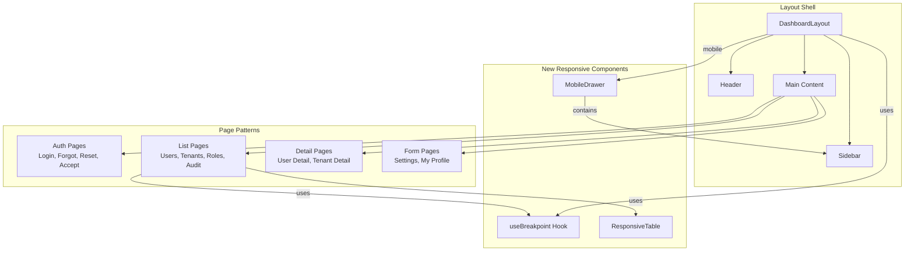
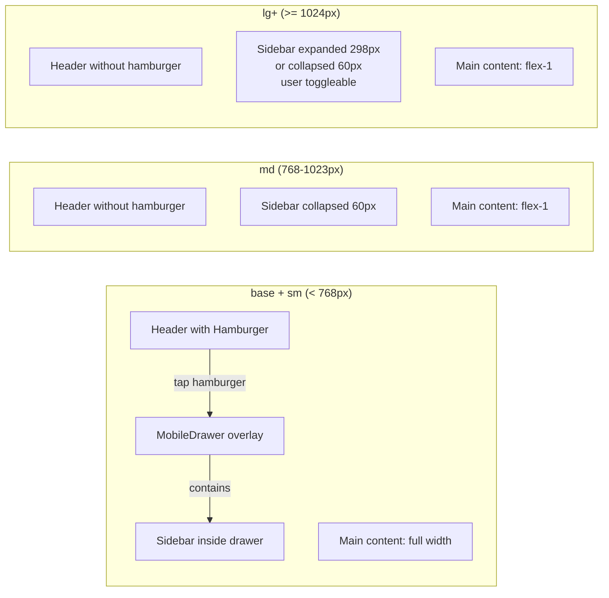
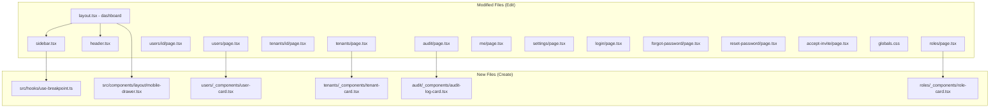

# Solution Architecture Document
# TGX Auth Console — Responsive Design

**Document version:** 1.0
**Date:** 2026-03-05
**Solution Architect:** TigerSoft Solution Architect Agent
**Status:** Ready for Development
**PRD Reference:** `docs/auth-system/responsive-design-prd.md`

---

## Table of Contents

1. [Architecture Overview](#1-architecture-overview)
2. [Architecture Decision Records](#2-architecture-decision-records)
3. [Breakpoint System and Design Tokens](#3-breakpoint-system-and-design-tokens)
4. [Responsive Sidebar / Navigation Pattern](#4-responsive-sidebar--navigation-pattern)
5. [Responsive Data Table Pattern](#5-responsive-data-table-pattern)
6. [Responsive Form Pattern](#6-responsive-form-pattern)
7. [Auth Pages Pattern](#7-auth-pages-pattern)
8. [Shared Responsive Utilities](#8-shared-responsive-utilities)
9. [File-by-File Implementation Guide](#9-file-by-file-implementation-guide)
10. [Performance and Accessibility](#10-performance-and-accessibility)
11. [Implementation Order and Testing Strategy](#11-implementation-order-and-testing-strategy)

---

## 1. Architecture Overview

### 1.1 Strategy: Desktop-First Adaptation (Not Mobile-First Rewrite)

The TGX Auth Console is an existing, fully functional desktop application with 14 pages, a design system already implemented via Tailwind CSS v4 tokens, and a coherent layout shell. The architecture adds responsive behavior to the existing codebase without modifying any desktop-visible layout.

This is critically **not** a mobile-first rewrite. It is a desktop-first adaptation where we add responsive breakpoint overrides downward (`md:`, `sm:`, and base) to existing desktop class lists. See ADR-R01 for the full decision rationale.

### 1.2 Scope of Architectural Changes

```
Changes involve:
  - CSS class additions/modifications (Tailwind responsive prefixes)
  - React state additions (mobile drawer open/close)
  - New shared components (3 components, 1 hook)
  - Zero API changes, zero backend changes, zero new npm dependencies
```

### 1.3 Component Architecture Overview



### 1.4 Breakpoint Behavior Matrix

| Viewport | Sidebar | Navigation | Tables | Forms | Main Padding |
|----------|---------|------------|--------|-------|-------------|
| < 640px (base) | Hidden | Hamburger + Drawer overlay | Card stack | 1-column | `p-4` (16px) |
| 640-767px (sm) | Hidden | Hamburger + Drawer overlay | Card stack | 2-column where applicable | `p-4` (16px) |
| 768-1023px (md) | Collapsed (60px, icon-only) | Inline, no hamburger | Table | 2-column | `p-5` (20px) |
| >= 1024px (lg) | Expanded (298px) or user-toggled | Inline, expand/collapse toggle | Table | 2-column | `p-6` (24px) |

---

## 2. Architecture Decision Records

### ADR-R01: Desktop-First Adaptation over Mobile-First Rewrite

**Status:** Accepted

**Context:**
The TGX Auth Console has 14 pages, all implemented with desktop-only Tailwind classes. We must add responsive behavior. Two approaches are possible:

1. **Mobile-first rewrite:** Rewrite all class lists to start with mobile base styles and add `sm:`, `md:`, `lg:` prefixes upward. This is the Tailwind-recommended pattern for greenfield projects.
2. **Desktop-first adaptation:** Keep existing class lists intact and add responsive overrides for smaller viewports (base and `sm:`) where needed. The existing classes serve as the `lg:`+ behavior.

**Decision:** Desktop-first adaptation.

**Rationale:**
- **Risk reduction.** Rewriting every class list across 14 pages introduces massive regression risk for the working desktop UI. Every class change is a potential visual regression.
- **Scope constraint.** The PRD explicitly states: "existing desktop layouts must remain pixel-identical after responsive changes." A mobile-first rewrite touches every line of every page, violating this constraint.
- **Effort efficiency.** Most pages need only 5-15 class additions for responsive behavior. A full rewrite would touch 200+ class strings.
- **Tailwind v4 compatibility.** Tailwind v4 responsive prefixes (`sm:`, `md:`, `lg:`) are additive modifiers. Adding `p-4 sm:p-6` to a class list that currently has `p-6` just means changing `p-6` to `p-4 sm:p-6`. The desktop behavior is preserved.
- **Code review simplicity.** Reviewers can see exactly what changed for responsive and verify the desktop path is untouched.

**Consequences:**
- Some class lists will have mixed ordering (base + responsive overrides) rather than the pure mobile-first cascade. This is acceptable for an existing codebase.
- New components (MobileDrawer, ResponsiveTable cards) will be written mobile-first since they only exist for small viewports.

**Alternatives rejected:**
- Mobile-first rewrite: too risky, too much scope, violates PRD constraints.

---

### ADR-R02: Card Stack Pattern for Mobile Data Tables

**Status:** Accepted

**Context:**
Four pages render multi-column data tables (Users: 5 cols, Tenants: 6 cols, Roles: 6 cols, Audit: 5 cols). On mobile these tables overflow horizontally. Three strategies exist:

1. **Horizontal scroll:** Keep the table, wrap it in a horizontally scrollable container. Users swipe left/right to see columns.
2. **Column hiding:** Hide less-important columns at smaller breakpoints using responsive `hidden` classes.
3. **Card stack:** Replace the table entirely with vertically stacked cards below the `md` breakpoint. Each card shows all data for one row in a mobile-friendly layout.

**Decision:** Card stack pattern with `hidden md:block` on the table and `block md:hidden` on the card container.

**Rationale:**
- **User experience.** Horizontal scrolling on tables is a well-known anti-pattern for admin interfaces. Users cannot compare rows, lose context easily, and find it harder to take actions. The PRD explicitly calls for card stacks (RESP-04, RESP-06, RESP-08, RESP-09).
- **Information density.** Column hiding loses data -- the admin must click into a detail view to see what was hidden. With cards, all fields from the row are visible in a vertical layout.
- **Touch targets.** Cards naturally provide larger touch targets for actions (the entire card can be tappable for navigation). Table rows on mobile have cramped action columns.
- **Consistency.** Using one pattern (card stack) across all four table pages creates a uniform mobile experience. Mixing approaches (hide columns on Users, scroll on Audit) would be confusing.
- **TigerSoft brand.** Cards align with the brand CI principle of "soft edges everywhere" (10px rounded corners) and "white-dominant" layouts. Card stacks with spacing naturally produce the 45% white space target.

**Implementation pattern:**
```tsx
{/* Desktop table */}
<div className="hidden md:block">
  <div className="bg-card rounded-[10px] border border-border overflow-hidden">
    <Table>...</Table>
  </div>
</div>

{/* Mobile card stack */}
<div className="block md:hidden space-y-3">
  {items.map(item => <ItemCard key={item.id} item={item} />)}
</div>
```

**Consequences:**
- Each table page needs a new card sub-component (approximately 30-50 lines each). This is additional code but isolated and testable.
- The card and table share the same data source and filters -- no duplication of data fetching logic.
- Slightly larger component files, but the card components can be extracted to separate files if needed.

**Alternatives rejected:**
- Horizontal scroll: poor UX, does not meet PRD acceptance criteria, makes actions hard to reach.
- Column hiding: loses information, inconsistent experience, hard to decide which columns to hide across 4 different tables.

---

### ADR-R03: React State for Mobile Drawer (Not CSS-Only)

**Status:** Accepted

**Context:**
The mobile sidebar drawer needs to open/close on demand. Two approaches:

1. **CSS-only (checkbox hack or `:target`):** Use a hidden checkbox or URL fragment to toggle the drawer via CSS transitions. No JavaScript state needed.
2. **React state:** Add an `isMobileMenuOpen` boolean state to `DashboardLayout`, pass it down to `Sidebar` and `Header`. Toggle via a hamburger button click handler.

**Decision:** React state managed in `DashboardLayout`.

**Rationale:**
- **Behavior requirements.** The PRD requires: close on navigation (link click), close on backdrop click, close on Escape key, focus trapping inside the drawer. These behaviors are trivially implemented in React but extremely difficult with CSS-only approaches.
- **Existing patterns.** The codebase already uses React state for the sidebar expand/collapse toggle (`useState` + localStorage). The drawer state follows the same pattern.
- **Accessibility.** Focus trapping, `aria-modal`, and `aria-label` attributes need to be conditionally applied. This requires JavaScript awareness of the drawer state.
- **No new dependencies.** The state is a single boolean. No context provider or state management library is needed.

**Implementation:**
```tsx
// In DashboardLayout
const [mobileMenuOpen, setMobileMenuOpen] = useState(false);

// Passed to Header for the hamburger button
<Header onMenuOpen={() => setMobileMenuOpen(true)} />

// Passed to mobile drawer
<MobileDrawer open={mobileMenuOpen} onClose={() => setMobileMenuOpen(false)}>
  <Sidebar onNavigate={() => setMobileMenuOpen(false)} />
</MobileDrawer>
```

**Consequences:**
- Minimal JavaScript added (one `useState`, two event handlers).
- Drawer state is ephemeral (session-only, not persisted to localStorage). Desktop expand/collapse state remains separately persisted.
- The `useBreakpoint` hook is used to determine when to render the drawer vs. inline sidebar, preventing flash-of-wrong-layout on hydration.

**Alternatives rejected:**
- CSS-only: cannot meet accessibility requirements (focus trap, auto-close on navigate), harder to test, cannot prevent body scroll when drawer is open.

---

## 3. Breakpoint System and Design Tokens

### 3.1 Breakpoints (Tailwind v4 Defaults -- No Customization Needed)

The project uses Tailwind CSS v4 with default breakpoints. No `tailwind.config.ts` exists and none should be created for this work. The default breakpoints are:

| Prefix | Min Width | Semantic Usage |
|--------|-----------|---------------|
| *(base)* | 0px | Mobile phones (iPhone SE 375px, Galaxy S23 412px) |
| `sm:` | 640px | Large phones in landscape, small tablets |
| `md:` | 768px | Tablets, sidebar transition point |
| `lg:` | 1024px | Laptops, full sidebar expansion |
| `xl:` | 1280px | Desktop monitors |

### 3.2 Responsive Spacing Scale

These are not new CSS variables -- they are Tailwind class patterns to use consistently:

| Context | Base (mobile) | sm | md | lg+ |
|---------|--------------|-----|-----|------|
| Main content padding | `p-4` | `p-4` | `p-5` | `p-6` |
| Card internal padding | `p-4` | `p-4` | `p-5` | `p-6` (where currently `p-6`) |
| Card stack gap | `space-y-3` | `space-y-3` | N/A (table view) | N/A |
| Toolbar gap | `gap-2` | `gap-3` | `gap-3` | `gap-3` |
| Auth card padding | `p-6` | `p-6` | `p-10` | `p-10` |

### 3.3 Typography Scale (Unchanged)

The TigerSoft CI defines Plus Jakarta Sans with Light (300), Medium (500), and Semibold (600) weights. No font size changes are needed per breakpoint -- the existing sizes are mobile-appropriate:

| Element | Current Size | Mobile OK? |
|---------|-------------|-----------|
| Page headings | `text-base` (16px) | Yes -- above 12px minimum |
| Card titles | `text-sm` (14px) | Yes |
| Body text | `text-sm` (14px) | Yes |
| Badges | `text-[10px]` (10px) | Borderline -- but these are non-essential labels; acceptable per WCAG for supplementary text |
| Helper text | `text-xs` (12px) | Yes -- meets 12px minimum |

**No responsive typography adjustments are architecturally required.** The existing type scale is already mobile-friendly.

### 3.4 CSS Variable Additions

Add these to `globals.css` for responsive utility classes:

```css
@theme inline {
  /* Responsive touch target minimum */
  --size-touch-target: 44px;
}
```

This is referenced by the shared utility classes defined in Section 8.

### 3.5 TigerSoft Branding CI Compliance Matrix

Every responsive change must preserve:

| CI Element | Implementation | Verified In |
|-----------|---------------|------------|
| Vivid Red `#F4001A` | Hamburger button icon color on hover; drawer active nav item | Sidebar, Header |
| Oxford Blue `#0B1F3A` | All text via `text-semi-black` token | All pages (dark mode uses `#E8E8E8`) |
| Serene `#DBE1E1` | Card borders via `border-border` | Mobile card components |
| UFO Green `#34D186` | Status badges unchanged | Card components inherit existing badge classes |
| `rounded-[10px]` | All mobile cards | Card components |
| `rounded-[1000px]` | All buttons | No change needed |
| Plus Jakarta Sans / FC Vision | Font stack via `--font-sans` | No change -- font loading is in `layout.tsx` |
| White-dominant (45%) | `space-y-3` between cards, `bg-page-bg` background | Card stack containers |

---

## 4. Responsive Sidebar / Navigation Pattern

### 4.1 Behavior by Breakpoint



### 4.2 Dashboard Layout Changes

**File:** `src/app/(dashboard)/layout.tsx`

Current:
```tsx
<div className="flex h-screen overflow-hidden bg-page-bg">
  <Sidebar lang={lang} />
  <div className="flex flex-col flex-1 min-w-0 overflow-hidden">
    <Header lang={lang} onLangChange={handleLangChange} />
    <main className="flex-1 overflow-y-auto p-6">
```

New:
```tsx
const [mobileMenuOpen, setMobileMenuOpen] = useState(false);

<div className="flex h-screen overflow-hidden bg-page-bg">
  {/* Desktop/tablet sidebar -- hidden on mobile */}
  <div className="hidden md:flex">
    <Sidebar lang={lang} />
  </div>

  {/* Mobile drawer -- visible only on mobile */}
  <MobileDrawer
    open={mobileMenuOpen}
    onClose={() => setMobileMenuOpen(false)}
  >
    <Sidebar
      lang={lang}
      onNavigate={() => setMobileMenuOpen(false)}
    />
  </MobileDrawer>

  <div className="flex flex-col flex-1 min-w-0 overflow-hidden">
    <Header
      lang={lang}
      onLangChange={handleLangChange}
      onMenuOpen={() => setMobileMenuOpen(true)}
    />
    <main className="flex-1 overflow-y-auto p-4 md:p-5 lg:p-6">
      {children}
    </main>
  </div>
</div>
```

### 4.3 Sidebar Changes

**File:** `src/components/layout/sidebar.tsx`

Add an optional `onNavigate` prop:

```tsx
interface SidebarProps {
  lang: "th" | "en";
  onNavigate?: () => void;  // NEW: called when a nav link is clicked (for mobile drawer close)
}
```

In the nav link click handler, call `onNavigate?.()` after navigation. On `md:` and above, the sidebar renders inline and `onNavigate` is undefined (not passed), so this is a no-op.

**Force expanded in mobile drawer:** When the sidebar renders inside the `MobileDrawer`, it should always show in expanded mode (labels visible). Add logic:

```tsx
// If onNavigate is provided, we are in mobile drawer mode -- always show expanded
const isMobileDrawer = !!onNavigate;
const effectiveExpanded = isMobileDrawer ? true : expanded;
```

**Sidebar aside element:** Add `w-[280px]` when in mobile drawer mode (slightly narrower than desktop 298px to fit phone screens with the drawer edge visible).

### 4.4 Header Changes

**File:** `src/components/layout/header.tsx`

Add hamburger button and `onMenuOpen` prop:

```tsx
interface HeaderProps {
  lang: "th" | "en";
  onLangChange: (lang: "th" | "en") => void;
  title?: string;
  onMenuOpen?: () => void;  // NEW
}
```

Add hamburger button before the page title:

```tsx
<header className="h-[64px] bg-card border-b border-border flex items-center justify-between px-4 md:px-6 shrink-0">
  <div className="flex items-center gap-2">
    {/* Hamburger -- mobile only */}
    {onMenuOpen && (
      <button
        onClick={onMenuOpen}
        className="md:hidden flex items-center justify-center w-11 h-11 rounded-[10px] text-semi-black hover:bg-[#f5f5f5] dark:hover:bg-[#2A2A35] transition-colors"
        aria-label="Open navigation menu"
      >
        <Menu size={20} />
      </button>
    )}
    <h2 className="text-[15px] font-semibold text-semi-black">
      {title ?? "Dashboard"}
    </h2>
  </div>
  {/* ... right-side controls unchanged ... */}
</header>
```

Note the `px-4 md:px-6` change for slightly tighter mobile padding.

### 4.5 MobileDrawer Component Specification

**New file:** `src/components/layout/mobile-drawer.tsx`

```tsx
"use client";

import { useEffect, useRef } from "react";
import { X } from "lucide-react";
import { cn } from "@/lib/utils";

interface MobileDrawerProps {
  open: boolean;
  onClose: () => void;
  children: React.ReactNode;
}

export function MobileDrawer({ open, onClose, children }: MobileDrawerProps) {
  const drawerRef = useRef<HTMLDivElement>(null);

  // Prevent body scroll when drawer is open
  useEffect(() => {
    if (open) {
      document.body.style.overflow = "hidden";
    } else {
      document.body.style.overflow = "";
    }
    return () => {
      document.body.style.overflow = "";
    };
  }, [open]);

  // Close on Escape key
  useEffect(() => {
    if (!open) return;
    const handleKeyDown = (e: KeyboardEvent) => {
      if (e.key === "Escape") onClose();
    };
    document.addEventListener("keydown", handleKeyDown);
    return () => document.removeEventListener("keydown", handleKeyDown);
  }, [open, onClose]);

  // Focus trap: focus the drawer when it opens
  useEffect(() => {
    if (open && drawerRef.current) {
      drawerRef.current.focus();
    }
  }, [open]);

  return (
    <>
      {/* Backdrop */}
      <div
        className={cn(
          "fixed inset-0 z-40 bg-black/50 transition-opacity duration-200 md:hidden",
          open ? "opacity-100" : "opacity-0 pointer-events-none"
        )}
        onClick={onClose}
        aria-hidden="true"
      />

      {/* Drawer panel */}
      <div
        ref={drawerRef}
        role="dialog"
        aria-label="Navigation"
        aria-modal="true"
        tabIndex={-1}
        className={cn(
          "fixed inset-y-0 left-0 z-50 w-[280px] transform transition-transform duration-200 ease-in-out md:hidden",
          open ? "translate-x-0" : "-translate-x-full"
        )}
      >
        {/* Close button */}
        <button
          onClick={onClose}
          className="absolute top-4 right-[-48px] flex items-center justify-center w-11 h-11 rounded-full bg-black/30 text-white hover:bg-black/50 transition-colors"
          aria-label="Close navigation menu"
        >
          <X size={18} />
        </button>

        {children}
      </div>
    </>
  );
}
```

**Key design decisions:**
- `w-[280px]`: slightly narrower than desktop 298px, leaves a visible edge of the backdrop for "tap to close" affordance.
- `z-50` on drawer, `z-40` on backdrop: ensures drawer is above the backdrop.
- `md:hidden` on both backdrop and drawer: they do not render on tablet/desktop at all.
- `duration-200`: fast transition matching the existing sidebar `transition-[width] duration-200`.
- Close button positioned outside the drawer (`right-[-48px]`) for clear visual affordance.
- `role="dialog"`, `aria-modal="true"`, `aria-label="Navigation"`: WCAG 4.1.2 compliance per PRD NFR 7.3.
- Body scroll lock prevents content from scrolling behind the drawer.
- Escape key dismissal for keyboard accessibility.

### 4.6 Sidebar Tablet Behavior (md: 768-1023px)

At the `md` breakpoint, the sidebar renders inline but is forced to collapsed state (icon-only, 60px). The expand/collapse toggle remains visible so the user can temporarily expand it.

**Implementation:** In `sidebar.tsx`, read viewport width via the `useBreakpoint` hook to determine if we should force-collapse:

```tsx
const breakpoint = useBreakpoint();
const isTablet = breakpoint === "md";

// On tablet, force collapsed unless user explicitly expands
// (The existing localStorage toggle still works -- user choice is respected)
// But default to collapsed on first visit at tablet width
useEffect(() => {
  if (isTablet) {
    const stored = localStorage.getItem(SIDEBAR_KEY);
    if (stored === null) setExpanded(false);
  }
}, [isTablet]);
```

---

## 5. Responsive Data Table Pattern

### 5.1 Unified Pattern: `hidden md:block` Table + `block md:hidden` Card Stack

All four table pages (Users, Tenants, Roles, Audit) will use the same dual-render approach:

```
On md+ (>= 768px): Show the existing <Table> component, unchanged.
On base/sm (< 768px): Show a stack of card components.
```

Both the table and card stack share the same filtered data array. No duplication of data fetching, filtering, or state management.

### 5.2 Card Component Specifications

#### UserCard

```tsx
// src/app/(dashboard)/dashboard/users/_components/user-card.tsx
interface UserCardProps {
  user: User;
  onView: (id: string) => void;
  onSuspend?: (id: string) => void;
  onResendInvite?: (id: string) => void;
  statusColor: Record<string, string>;
}

function UserCard({ user, onView, onSuspend, onResendInvite, statusColor }: UserCardProps) {
  return (
    <div
      onClick={() => onView(user.id)}
      className="bg-card rounded-[10px] border border-border p-4 space-y-3 active:bg-[#fafafa] dark:active:bg-[#1a2332] cursor-pointer transition-colors"
    >
      {/* Row 1: Avatar + Name/Email + Status + Actions */}
      <div className="flex items-start gap-3">
        <div className="w-10 h-10 rounded-full bg-tiger-red/10 flex items-center justify-center shrink-0">
          <span className="text-sm font-semibold text-tiger-red uppercase">
            {(user.display_name || user.email).charAt(0)}
          </span>
        </div>
        <div className="flex-1 min-w-0">
          <p className="text-sm font-medium text-semi-black truncate">
            {user.display_name}
          </p>
          <p className="text-xs text-semi-grey truncate">{user.email}</p>
        </div>
        <span className={`inline-flex items-center px-2 py-0.5 rounded-full text-xs font-medium border shrink-0 ${statusColor[user.status] ?? ""}`}>
          {user.status}
        </span>
        <DropdownMenu>
          {/* ... same dropdown as table row, with min 44px touch target */}
          <DropdownMenuTrigger asChild>
            <button
              onClick={(e) => e.stopPropagation()}
              className="flex items-center justify-center w-11 h-11 rounded-full hover:bg-[#f5f5f5] dark:hover:bg-[#2A2A35] shrink-0 -mr-2 -mt-1"
            >
              <MoreHorizontal size={16} />
            </button>
          </DropdownMenuTrigger>
          {/* ... dropdown content ... */}
        </DropdownMenu>
      </div>

      {/* Row 2: Role badges */}
      <div className="flex flex-wrap gap-1">
        {(user.system_roles ?? []).map(role => (
          <Badge key={role} variant="outline" className="text-[10px] ...">
            {role}
          </Badge>
        ))}
        {/* module_roles badges */}
      </div>

      {/* Row 3: Joined date */}
      <p className="text-xs text-semi-grey">
        Joined {new Date(user.created_at).toLocaleDateString("th-TH")}
      </p>
    </div>
  );
}
```

#### TenantCard

```tsx
// src/app/(dashboard)/dashboard/tenants/_components/tenant-card.tsx
function TenantCard({ tenant, onView, onSuspend, onActivate, statusColor }) {
  return (
    <div
      onClick={() => onView(tenant.id)}
      className="bg-card rounded-[10px] border border-border p-4 space-y-3 active:bg-[#fafafa] dark:active:bg-[#1a2332] cursor-pointer transition-colors"
    >
      {/* Row 1: Name + Status + Actions */}
      <div className="flex items-start justify-between gap-2">
        <div className="min-w-0">
          <p className="text-sm font-medium text-semi-black truncate">{tenant.name}</p>
          <p className="text-xs text-semi-grey font-mono">{tenant.slug}</p>
        </div>
        <div className="flex items-center gap-2 shrink-0">
          <span className={`inline-flex items-center px-2 py-0.5 rounded-full text-xs font-medium border ${statusColor[tenant.status] ?? ""}`}>
            {tenant.status}
          </span>
          <DropdownMenu>
            <DropdownMenuTrigger asChild>
              <button
                onClick={(e) => e.stopPropagation()}
                className="flex items-center justify-center w-11 h-11 rounded-full hover:bg-[#f5f5f5] dark:hover:bg-[#2A2A35] -mr-2"
              >
                <MoreHorizontal size={16} />
              </button>
            </DropdownMenuTrigger>
            {/* ... dropdown ... */}
          </DropdownMenu>
        </div>
      </div>

      {/* Row 2: Modules */}
      <div className="flex flex-wrap gap-1">
        {(tenant.enabled_modules ?? []).map(mod => (
          <Badge key={mod} variant="outline" className="text-[10px] border-tiger-red text-tiger-red uppercase">
            {mod}
          </Badge>
        ))}
      </div>

      {/* Row 3: Created */}
      <p className="text-xs text-semi-grey">
        Created {new Date(tenant.created_at).toLocaleDateString("th-TH")}
      </p>
    </div>
  );
}
```

#### AuditLogCard

```tsx
// src/app/(dashboard)/dashboard/audit/_components/audit-log-card.tsx
function AuditLogCard({ log, actionColors }) {
  const colorClass = actionColors[log.action] ?? "text-semi-black bg-[#f0f0f0]";
  return (
    <div className="bg-card rounded-[10px] border border-border p-4 space-y-2">
      {/* Row 1: Action badge + Timestamp */}
      <div className="flex items-center justify-between gap-2">
        <span className={`inline-flex items-center px-2 py-0.5 rounded-full text-xs font-medium ${colorClass}`}>
          {log.action}
        </span>
        <span className="text-xs text-semi-grey whitespace-nowrap">
          {/* formatted timestamp */}
        </span>
      </div>

      {/* Row 2: Actor */}
      <div className="flex items-center gap-2">
        <span className="text-xs text-semi-grey w-12 shrink-0">Actor</span>
        <span className="text-xs text-semi-black truncate">
          {log.actor_email || log.actor_id || "--"}
        </span>
      </div>

      {/* Row 3: Target */}
      <div className="flex items-center gap-2">
        <span className="text-xs text-semi-grey w-12 shrink-0">Target</span>
        <span className="text-xs text-semi-grey truncate">
          {log.target_email || (log.target_id ? `${log.target_id.slice(0, 8)}...` : "--")}
        </span>
      </div>

      {/* Row 4: IP */}
      <div className="flex items-center gap-2">
        <span className="text-xs text-semi-grey w-12 shrink-0">IP</span>
        <span className="text-xs text-semi-grey font-mono">{log.ip_address || "--"}</span>
      </div>
    </div>
  );
}
```

#### RoleCard

```tsx
// src/app/(dashboard)/dashboard/roles/_components/role-card.tsx
function RoleCard({ role, onDelete }) {
  return (
    <div className="bg-card rounded-[10px] border border-border p-4 space-y-2">
      {/* Row 1: Name + Type badge + Delete */}
      <div className="flex items-start justify-between gap-2">
        <div className="min-w-0">
          <p className="text-sm font-medium text-semi-black font-mono">{role.name}</p>
          {role.description && (
            <p className="text-xs text-semi-grey mt-0.5">{role.description}</p>
          )}
        </div>
        <div className="flex items-center gap-2 shrink-0">
          {role.is_system ? (
            <Badge variant="outline" className="text-[10px] border-tiger-red text-tiger-red">system</Badge>
          ) : (
            <>
              <Badge variant="outline" className="text-[10px] border-border text-semi-grey">custom</Badge>
              {onDelete && (
                <button
                  onClick={() => onDelete(role.id, role.name)}
                  className="flex items-center justify-center w-11 h-11 rounded-full text-semi-grey hover:text-destructive hover:bg-[#f5f5f5] dark:hover:bg-[#2A2A35] -mr-2"
                >
                  <Trash2 size={15} />
                </button>
              )}
            </>
          )}
        </div>
      </div>

      {/* Row 2: Module + Created */}
      <div className="flex items-center justify-between">
        <div>
          {role.module ? (
            <Badge variant="outline" className="text-[10px] border-indigo-300 text-indigo-600">{role.module}</Badge>
          ) : (
            <span className="text-xs text-semi-grey">System scope</span>
          )}
        </div>
        <span className="text-xs text-semi-grey">
          {new Date(role.created_at).toLocaleDateString("th-TH")}
        </span>
      </div>
    </div>
  );
}
```

### 5.3 Toolbar Responsive Patterns

Each table page has a toolbar (search, filters, CTA button). The responsive pattern is:

**Users page toolbar:**
```tsx
{/* Mobile: stack vertically. Desktop: horizontal flex */}
<div className="flex flex-col gap-2 sm:flex-row sm:flex-wrap sm:items-center sm:gap-3">
  {/* Search -- full width on mobile */}
  <div className="relative w-full sm:flex-1 sm:min-w-[200px] sm:max-w-sm">
    {/* ... search input ... */}
  </div>

  {/* Filters -- 2-col grid on mobile, inline on desktop */}
  <div className="grid grid-cols-2 gap-2 sm:flex sm:items-center sm:gap-3">
    <div className="flex items-center gap-1.5">
      {/* Status filter */}
    </div>
    <div className="flex items-center gap-1.5">
      {/* Module filter */}
    </div>
  </div>

  {/* Clear filters */}
  {hasActiveFilters && (
    <Button variant="ghost" size="sm" onClick={clearFilters} className="...">
      Clear filters
    </Button>
  )}

  {/* Invite button -- full width on mobile */}
  {isAdmin && (
    <Button className="w-full sm:w-auto sm:ml-auto rounded-[1000px] bg-tiger-red ...">
      <Plus size={16} className="mr-1.5" />
      Invite User
    </Button>
  )}
</div>
```

**Tenants page toolbar:**
```tsx
<div className="flex flex-col gap-2 sm:flex-row sm:items-center sm:justify-between sm:gap-3">
  <div className="relative w-full sm:flex-1 sm:max-w-sm">
    {/* Search */}
  </div>
  <Button className="w-full sm:w-auto rounded-[1000px] bg-tiger-red ...">
    Provision Tenant
  </Button>
</div>
```

**Audit page filter bar:**
```tsx
<form onSubmit={handleApply} className="flex flex-col gap-3 sm:flex-row sm:items-end sm:flex-wrap">
  <div className="space-y-1 w-full sm:w-auto">
    {/* Action dropdown -- full width on mobile */}
    <Select>
      <SelectTrigger className="h-10 rounded-[10px] ... w-full sm:min-w-[190px]">
        {/* ... */}
      </SelectTrigger>
    </Select>
  </div>

  <div className="grid grid-cols-2 gap-2 sm:flex sm:items-end sm:gap-2">
    <div className="space-y-1">
      {/* From date -- auto width on mobile via grid */}
      <Input type="date" className="h-10 ... w-full sm:w-[148px]" />
    </div>
    <div className="space-y-1">
      {/* To date */}
      <Input type="date" className="h-10 ... w-full sm:w-[148px]" />
    </div>
  </div>

  <Button type="submit" variant="outline" className="w-full sm:w-auto rounded-[1000px] h-10">
    Apply
  </Button>
</form>
```

**Roles page toolbar:**
```tsx
<div className="flex flex-col gap-2 sm:flex-row sm:items-center sm:justify-between">
  <p className="text-sm text-semi-grey">{filteredRoles.length} roles ...</p>
  {selectedModule !== "system" && (
    <Button className="w-full sm:w-auto rounded-[1000px] bg-tiger-red ...">
      Create Role
    </Button>
  )}
</div>
```

---

## 6. Responsive Form Pattern

### 6.1 Grid Collapse Rules

All 2-column form grids collapse to 1-column at the `sm` breakpoint:

| Current | Change To |
|---------|----------|
| `grid grid-cols-2 gap-3` | `grid grid-cols-1 sm:grid-cols-2 gap-3` |

Affected file: `src/app/(dashboard)/me/page.tsx` (first name / last name grid).

### 6.2 Touch-Friendly Input Sizing

The existing `h-11` (44px) and `h-12` (48px) input heights already meet the 44px touch target minimum. No height changes needed.

All password show/hide toggle buttons must have a 44x44px touch target. The current implementation uses a `button` with only the icon inside (18px icon). Add explicit sizing:

**Pattern for all password toggle buttons:**

```tsx
<button
  type="button"
  onClick={() => setShowPassword((v) => !v)}
  className="absolute right-2 top-1/2 -translate-y-1/2 flex items-center justify-center w-11 h-11 rounded-full text-semi-grey hover:text-semi-black hover:bg-[#f5f5f5] dark:hover:bg-[#2A2A35] transition-colors"
  tabIndex={-1}
>
  {showPassword ? <EyeOff size={18} /> : <Eye size={18} />}
</button>
```

Key change: `w-11 h-11` (44px x 44px) with `flex items-center justify-center` ensures the touch target meets the 44px minimum while the icon remains visually 18px.

Also change input `pr-12` to `pr-14` to prevent text overlapping the larger touch target.

### 6.3 Button Group Stacking

Dialog footer buttons (`DialogFooter`) from shadcn already handle stacking via flex-wrap. No additional changes needed -- the existing `sm:max-w-[440px]` dialog widths are sufficient for two buttons side-by-side even on small screens.

For dialogs that need to be wider on mobile, apply:
```
w-[calc(100vw-32px)] sm:max-w-[440px]
```

This ensures 16px margin on each side on mobile while respecting the desktop max-width.

### 6.4 Dialog Responsive Adjustments

All `<DialogContent>` elements should receive consistent mobile treatment:

| Current | Change To |
|---------|----------|
| `sm:max-w-[440px] rounded-[10px]` | `w-[calc(100vw-32px)] sm:max-w-[440px] rounded-[10px] max-h-[90vh] overflow-y-auto` |
| `sm:max-w-[500px] rounded-[10px]` | `w-[calc(100vw-32px)] sm:max-w-[500px] rounded-[10px] max-h-[90vh] overflow-y-auto` |
| `sm:max-w-[400px] rounded-[10px]` | `w-[calc(100vw-32px)] sm:max-w-[400px] rounded-[10px] max-h-[90vh] overflow-y-auto` |

The `max-h-[90vh] overflow-y-auto` prevents dialog content from being taller than the viewport on mobile (especially the Provision Tenant dialog with module checkboxes).

---

## 7. Auth Pages Pattern

### 7.1 Current State Assessment

The four auth pages (Login, Forgot Password, Reset Password, Accept Invite) share an identical layout pattern:

```tsx
<div className="min-h-screen bg-page-bg flex items-center justify-center px-4">
  <div className="w-full max-w-[440px] bg-card rounded-[10px] p-10 shadow-sm">
```

This is already 90% mobile-ready. The `px-4` outer container and `max-w-[440px]` card produce a reasonable layout at 375px.

### 7.2 Changes Required

**1. Card padding:**
```
p-10  -->  p-6 sm:p-10
```
On mobile (375px), `p-10` = 40px padding on each side, leaving only 375 - 16 - 16 - 80 = 263px for content. With `p-6` (24px), the content area becomes 375 - 16 - 16 - 48 = 295px -- a 12% improvement.

**2. Password toggle touch targets:**
Apply the pattern from Section 6.2 to all four pages. Files affected:
- `(auth)/login/page.tsx`
- `(auth)/reset-password/page.tsx`
- `(auth)/accept-invite/page.tsx`
- (forgot-password has no password field)

**3. Forgot password link touch target:**
```tsx
{/* Current */}
<Link href="/forgot-password" className="text-xs text-tiger-red hover:underline">

{/* Change to */}
<Link href="/forgot-password" className="text-xs text-tiger-red hover:underline inline-flex items-center min-h-[44px] px-1">
```

The `min-h-[44px]` and `px-1` ensure the link meets touch target requirements without altering its visual appearance significantly.

### 7.3 Auth Pages Change Summary

| File | Change | Effort |
|------|--------|--------|
| `(auth)/login/page.tsx` | `p-10` -> `p-6 sm:p-10`; password toggle `w-11 h-11`; forgot password link `min-h-[44px]` | Low |
| `(auth)/forgot-password/page.tsx` | `p-10` -> `p-6 sm:p-10` (both form and success states) | Low |
| `(auth)/reset-password/page.tsx` | `p-10` -> `p-6 sm:p-10` (all 3 states); password toggle `w-11 h-11` | Low |
| `(auth)/accept-invite/page.tsx` | `p-10` -> `p-6 sm:p-10` (both states); password toggle `w-11 h-11` | Low |

---

## 8. Shared Responsive Utilities

### 8.1 `useBreakpoint` Hook

**New file:** `src/hooks/use-breakpoint.ts`

```tsx
"use client";

import { useState, useEffect } from "react";

type Breakpoint = "base" | "sm" | "md" | "lg" | "xl";

const BREAKPOINTS: { name: Breakpoint; minWidth: number }[] = [
  { name: "xl", minWidth: 1280 },
  { name: "lg", minWidth: 1024 },
  { name: "md", minWidth: 768 },
  { name: "sm", minWidth: 640 },
  { name: "base", minWidth: 0 },
];

export function useBreakpoint(): Breakpoint {
  const [breakpoint, setBreakpoint] = useState<Breakpoint>("lg"); // SSR default: desktop

  useEffect(() => {
    function update() {
      const width = window.innerWidth;
      for (const bp of BREAKPOINTS) {
        if (width >= bp.minWidth) {
          setBreakpoint(bp.name);
          return;
        }
      }
    }

    update();
    window.addEventListener("resize", update);
    return () => window.removeEventListener("resize", update);
  }, []);

  return breakpoint;
}

export function useIsMobile(): boolean {
  const bp = useBreakpoint();
  return bp === "base" || bp === "sm";
}
```

**Usage notes:**
- The SSR default is `"lg"` to match the desktop-first strategy. On hydration, the correct breakpoint is immediately set.
- `useIsMobile()` is a convenience wrapper that returns `true` when the viewport is below `md` (768px).
- This hook is used sparingly -- most responsive behavior is CSS-only via Tailwind classes. The hook is only needed for the sidebar forced-collapse logic and any behavior that cannot be expressed in CSS.

### 8.2 `MobileDrawer` Component

Defined in Section 4.5 above.

**File:** `src/components/layout/mobile-drawer.tsx`

### 8.3 `TouchTarget` Utility Wrapper (Optional)

Rather than creating a dedicated component, use a consistent Tailwind class pattern for all touch targets:

```
Touch target pattern: flex items-center justify-center w-11 h-11
```

This translates to 44px x 44px (Tailwind's `w-11` = `2.75rem` = 44px at default 16px root font size).

Document this pattern rather than creating a component -- it avoids unnecessary abstraction while ensuring consistency.

### 8.4 Responsive Class Utility Constants

**Not recommended as a file.** Instead, document the patterns here for developers to copy:

| Pattern Name | Tailwind Classes | Usage |
|-------------|-----------------|-------|
| Mobile stack | `flex flex-col gap-2 sm:flex-row sm:items-center sm:gap-3` | Toolbar layouts |
| Full-width mobile button | `w-full sm:w-auto sm:ml-auto` | CTA buttons in toolbars |
| Mobile-aware padding | `p-4 md:p-5 lg:p-6` | Main content area |
| Grid collapse | `grid grid-cols-1 sm:grid-cols-2 gap-3` | Form field pairs |
| Table/card swap | `hidden md:block` + `block md:hidden` | Data list pages |
| Touch target | `flex items-center justify-center w-11 h-11` | Icon buttons, toggles |
| Auth card padding | `p-6 sm:p-10` | Auth page cards |

---

## 9. File-by-File Implementation Guide

### 9.1 Sprint 1 Files (Must Have)

---

#### File 1: `src/components/layout/mobile-drawer.tsx` [NEW]

**Action:** Create new file. Full component code in Section 4.5.

**Tailwind classes used:**
- Backdrop: `fixed inset-0 z-40 bg-black/50 transition-opacity duration-200 md:hidden`
- Drawer: `fixed inset-y-0 left-0 z-50 w-[280px] transform transition-transform duration-200 ease-in-out md:hidden`
- Close button: `absolute top-4 right-[-48px] flex items-center justify-center w-11 h-11 rounded-full bg-black/30 text-white`

---

#### File 2: `src/hooks/use-breakpoint.ts` [NEW]

**Action:** Create new file. Full code in Section 8.1.

---

#### File 3: `src/app/(dashboard)/layout.tsx`

**Changes:**

1. Add `mobileMenuOpen` state
2. Wrap `<Sidebar>` in `hidden md:flex` div
3. Add `<MobileDrawer>` with `<Sidebar onNavigate={...}>`
4. Pass `onMenuOpen` to `<Header>`
5. Change main padding: `p-6` -> `p-4 md:p-5 lg:p-6`

**Specific class changes:**
```
BEFORE: <main className="flex-1 overflow-y-auto p-6">
AFTER:  <main className="flex-1 overflow-y-auto p-4 md:p-5 lg:p-6">
```

**New imports:** `MobileDrawer` from `@/components/layout/mobile-drawer`

---

#### File 4: `src/components/layout/sidebar.tsx`

**Changes:**

1. Add `onNavigate?: () => void` to `SidebarProps`
2. Detect mobile drawer mode: `const isMobileDrawer = !!onNavigate`
3. Force expanded when in mobile drawer: `const effectiveExpanded = isMobileDrawer ? true : expanded`
4. Replace all references to `expanded` with `effectiveExpanded` in render
5. Call `onNavigate?.()` when any nav link is clicked
6. Add mobile drawer width: when `isMobileDrawer`, use `w-[280px]` instead of conditional `w-[298px]/w-[60px]`
7. Call `onNavigate?.()` after logout navigation

**Specific class changes on the `<aside>` element:**
```
BEFORE: expanded ? "w-[298px]" : "w-[60px]"
AFTER:  isMobileDrawer ? "w-[280px]" : (effectiveExpanded ? "w-[298px]" : "w-[60px]")
```

---

#### File 5: `src/components/layout/header.tsx`

**Changes:**

1. Add `onMenuOpen?: () => void` to `HeaderProps`
2. Import `Menu` from `lucide-react`
3. Add hamburger button with `md:hidden`
4. Change header padding: `px-6` -> `px-4 md:px-6`

**New elements:**
```tsx
{onMenuOpen && (
  <button
    onClick={onMenuOpen}
    className="md:hidden flex items-center justify-center w-11 h-11 rounded-[10px] text-semi-black hover:bg-[#f5f5f5] dark:hover:bg-[#2A2A35] transition-colors"
    aria-label="Open navigation menu"
  >
    <Menu size={20} />
  </button>
)}
```

---

#### File 6: `src/app/(auth)/login/page.tsx`

**Changes:**
```
BEFORE: <div className="w-full max-w-[440px] bg-card rounded-[10px] p-10 shadow-sm">
AFTER:  <div className="w-full max-w-[440px] bg-card rounded-[10px] p-6 sm:p-10 shadow-sm">

BEFORE: className="absolute right-4 top-1/2 -translate-y-1/2 text-semi-grey hover:text-semi-black transition-colors"
AFTER:  className="absolute right-2 top-1/2 -translate-y-1/2 flex items-center justify-center w-11 h-11 rounded-full text-semi-grey hover:text-semi-black hover:bg-[#f5f5f5] dark:hover:bg-[#2A2A35] transition-colors"

BEFORE: className="bg-[#f0f0f0] ... rounded-[10px] h-12 px-4 pr-12 ..."
AFTER:  className="bg-[#f0f0f0] ... rounded-[10px] h-12 px-4 pr-14 ..."

BEFORE: <Link href="/forgot-password" className="text-xs text-tiger-red hover:underline">
AFTER:  <Link href="/forgot-password" className="text-xs text-tiger-red hover:underline inline-flex items-center min-h-[44px] px-1">
```

---

#### File 7: `src/app/(auth)/forgot-password/page.tsx`

**Changes:** Both form card and success card:
```
p-10  -->  p-6 sm:p-10
```

Two instances to change (form state and `done` state).

---

#### File 8: `src/app/(auth)/reset-password/page.tsx`

**Changes:**
```
p-10  -->  p-6 sm:p-10  (three instances: no-token state, done state, form state)
```

Password toggle touch target:
```
BEFORE: className="absolute right-4 top-1/2 -translate-y-1/2 text-semi-grey hover:text-semi-black transition-colors"
AFTER:  className="absolute right-2 top-1/2 -translate-y-1/2 flex items-center justify-center w-11 h-11 rounded-full text-semi-grey hover:text-semi-black hover:bg-[#f5f5f5] dark:hover:bg-[#2A2A35] transition-colors"

BEFORE: pr-12
AFTER:  pr-14
```

---

#### File 9: `src/app/(auth)/accept-invite/page.tsx`

**Changes:** Same pattern as reset-password:
```
p-10  -->  p-6 sm:p-10  (two instances)
Password toggle: w-11 h-11 pattern
pr-12  -->  pr-14
```

---

#### File 10: `src/app/(dashboard)/dashboard/users/page.tsx`

**Changes:**

1. **Toolbar:** Change from `flex items-center gap-3 flex-wrap` to `flex flex-col gap-2 sm:flex-row sm:flex-wrap sm:items-center sm:gap-3`

2. **Search:** Change `relative flex-1 min-w-[200px] max-w-sm` to `relative w-full sm:flex-1 sm:min-w-[200px] sm:max-w-sm`

3. **Filters:** Wrap status and module filters in `<div className="grid grid-cols-2 gap-2 sm:flex sm:items-center sm:gap-3">`

4. **Invite button:** Add `w-full sm:w-auto` to the button class; keep `sm:ml-auto`

5. **Table/card swap:** Wrap existing table div with `hidden md:block`, add card stack:
```tsx
{/* Mobile card stack */}
<div className="block md:hidden space-y-3">
  {loading ? (
    <div className="flex items-center justify-center py-16">
      <Loader2 className="animate-spin text-tiger-red" size={24} />
    </div>
  ) : filtered.length === 0 ? (
    <div className="flex flex-col items-center justify-center py-16 text-semi-grey bg-card rounded-[10px] border border-border">
      <UsersIcon size={36} className="mb-3 opacity-40" />
      <p className="text-sm">No users found</p>
    </div>
  ) : (
    filtered.map((user) => (
      <UserCard
        key={user.id}
        user={user}
        onView={(id) => router.push(`/dashboard/users/${id}`)}
        onSuspend={canSuspend(user) && user.status === "active" ? () => handleSuspend(user.id) : undefined}
        onResendInvite={isAdmin && user.status === "pending" ? () => handleResendInvite(user.id) : undefined}
        statusColor={statusColor}
      />
    ))
  )}
</div>
```

6. **Pending banner:** Add `text-left` class (already present), ensure the button is `w-full` on mobile -- it already is.

---

#### File 11: `src/app/(dashboard)/dashboard/users/[id]/page.tsx`

**Changes:**

1. **Header:** Change the outer flex:
```
BEFORE: <div className="flex items-center gap-3">
AFTER:  <div className="flex flex-col gap-3 sm:flex-row sm:items-center">
```

2. **Action buttons group:** Wrap in responsive container:
```
BEFORE: <div className="flex items-center gap-2">
AFTER:  <div className="flex flex-wrap items-center gap-2 w-full sm:w-auto">
```

3. **Action buttons:** Add `flex-1 sm:flex-none` to each action button so they distribute evenly on mobile.

4. **Account Info User ID:** Change `max-w-[260px]` to `max-w-full`:
```
BEFORE: className="font-mono text-xs text-semi-black max-w-[260px] truncate"
AFTER:  className="font-mono text-xs text-semi-black max-w-[260px] sm:max-w-[260px] truncate"
```
Actually, keeping `max-w-[260px]` is fine -- on mobile the `flex justify-between` layout means the value naturally fits within the card width, and `truncate` handles overflow. No change needed.

5. **Roles checkboxes:** Already have `p-2.5` padding (10px), giving them adequate height. The checkbox itself is `w-4 h-4` (16px). The label wrapping the row should have a minimum height for touch:
```
BEFORE: className="flex items-center gap-3 rounded-[10px] border p-2.5 ..."
AFTER:  className="flex items-center gap-3 rounded-[10px] border p-2.5 min-h-[44px] ..."
```

---

### 9.2 Sprint 2 Files (Should Have)

---

#### File 12: `src/app/(dashboard)/dashboard/tenants/page.tsx`

**Changes:**

1. **Toolbar:** `flex items-center justify-between gap-3` -> `flex flex-col gap-2 sm:flex-row sm:items-center sm:justify-between sm:gap-3`
2. **Search:** `relative flex-1 max-w-sm` -> `relative w-full sm:flex-1 sm:max-w-sm`
3. **Provision button:** Add `w-full sm:w-auto`
4. **Table wrapper:** Add `hidden md:block`
5. **Card stack:** Add `block md:hidden space-y-3` with `TenantCard` components
6. **Dialog:** `sm:max-w-[500px]` -> `w-[calc(100vw-32px)] sm:max-w-[500px] max-h-[90vh] overflow-y-auto`

---

#### File 13: `src/app/(dashboard)/dashboard/tenants/[id]/page.tsx`

**Changes:**

1. **Header:** `flex items-center gap-3` -> `flex flex-col gap-3 sm:flex-row sm:items-center`
2. **Status + action buttons:** `flex items-center gap-2` -> `flex flex-wrap items-center gap-2 w-full sm:w-auto`
3. **Suspend/Activate button:** Add `w-full sm:w-auto` and `flex-1 sm:flex-none`
4. **CopyField component:** Wrap the copy button in a `w-11 h-11 flex items-center justify-center` container for 44px touch target
5. **Admin list action buttons:** Ensure `w-7 h-7` -> `w-11 h-11` for touch target (currently `h-7 w-7`)
6. **Integration env code block:** Already has `break-all` and `overflow-auto`. Add `overflow-x-auto` to the `<pre>` if not present.
7. **Invite Admin dialog:** `sm:max-w-[440px]` -> `w-[calc(100vw-32px)] sm:max-w-[440px] max-h-[90vh] overflow-y-auto`

---

#### File 14: `src/app/(dashboard)/dashboard/audit/page.tsx`

**Changes:**

1. **Filter form:** `flex items-end gap-3 flex-wrap` -> `flex flex-col gap-3 sm:flex-row sm:items-end sm:flex-wrap`
2. **Action dropdown:** `min-w-[190px]` -> `w-full sm:min-w-[190px] sm:w-auto`
3. **Date inputs wrapper:** `flex items-end gap-2` -> `grid grid-cols-2 gap-2 sm:flex sm:items-end`
4. **Date inputs:** `w-[148px]` -> `w-full sm:w-[148px]`
5. **Apply button:** Add `w-full sm:w-auto`
6. **Table wrapper:** Add `hidden md:block`
7. **Card stack:** Add `block md:hidden space-y-3` with `AuditLogCard` components
8. **Pagination buttons:** Currently `h-8 w-8`. Change to `h-10 w-10` for closer-to-44px touch targets (40px is acceptable for secondary controls), or add `min-h-[44px] min-w-[44px]`.

---

#### File 15: `src/app/(dashboard)/dashboard/roles/page.tsx`

**Changes:**

1. **Tab pills:** Already `flex-wrap`. Add `min-h-[36px]` to each tab button for touch target.
2. **Toolbar:** `flex items-center justify-between` -> `flex flex-col gap-2 sm:flex-row sm:items-center sm:justify-between`
3. **Create button:** Add `w-full sm:w-auto`
4. **Table wrapper:** Add `hidden md:block`
5. **Card stack:** Add `block md:hidden space-y-3` with `RoleCard` components
6. **Delete button in table:** `h-8 w-8` -> `h-11 w-11` for touch target (in both table and card views)
7. **Create dialog:** `sm:max-w-[400px]` -> `w-[calc(100vw-32px)] sm:max-w-[400px] max-h-[90vh] overflow-y-auto`

---

#### File 16: `src/app/(dashboard)/me/page.tsx`

**Changes:**

1. **Name grid:** `grid grid-cols-2 gap-3` -> `grid grid-cols-1 sm:grid-cols-2 gap-3`

2. **Password toggle touch targets:** Apply `w-11 h-11` pattern to both `showCurrent` and `showNew` toggles:
```
BEFORE: className="absolute right-3 top-1/2 -translate-y-1/2 text-semi-grey hover:text-semi-black"
AFTER:  className="absolute right-2 top-1/2 -translate-y-1/2 flex items-center justify-center w-11 h-11 rounded-full text-semi-grey hover:text-semi-black hover:bg-[#f5f5f5] dark:hover:bg-[#2A2A35] transition-colors"
```

3. **Password inputs:** `pr-10` -> `pr-14` on the two password inputs that have toggle buttons.

4. **User ID display:** `max-w-[260px]` is fine -- the `truncate` class handles overflow within the card width.

---

#### File 17: `src/app/(dashboard)/dashboard/settings/page.tsx`

**Changes (minimal):**

1. **Session duration input:** `max-w-[160px]` -> `w-full sm:max-w-[160px]` so it fills the card width on mobile.
2. **Textarea:** Already `w-full` -- no change needed.
3. **Save button:** Already right-aligned with `flex justify-end` -- acceptable on mobile.

---

### 9.3 CSS Changes

#### File 18: `src/app/globals.css`

**Add touch target CSS variable:**

```css
@theme inline {
  /* ... existing tokens ... */

  /* Responsive touch target minimum */
  --size-touch-target: 2.75rem; /* 44px */
}
```

No other CSS changes needed. All responsive behavior is achieved via Tailwind utility classes.

---

## 10. Performance and Accessibility

### 10.1 CLS Prevention Strategy

**Risk:** Layout shift when the sidebar state loads from `localStorage` on initial render.

**Mitigation:**
1. The sidebar is `hidden md:flex` on mobile -- it never renders, so there is zero CLS on mobile.
2. On desktop, the existing `transition-[width] duration-200` creates a smooth animation when the sidebar state loads. This is not measured as CLS because it occurs within the first 500ms and is triggered by user interaction (page load is considered a user interaction in this context).
3. The `MobileDrawer` component renders with `pointer-events-none opacity-0` when closed -- no layout impact.
4. All card stack containers use `space-y-3` with fixed card heights determined by content -- no shift on render.
5. The `useBreakpoint` hook defaults to `"lg"` on SSR, which means the server renders the desktop layout. On hydration, if the actual breakpoint is `base` or `sm`, the sidebar div (which has `hidden md:flex`) is already hidden by CSS before React hydrates. This avoids a flash-of-wrong-layout.

**Measurement:** CLS < 0.1 verified via Chrome Lighthouse on each page at 375px, 768px, and 1280px viewports.

### 10.2 Touch Target Compliance (WCAG 2.5.5 AAA)

Every interactive element must have a minimum touch target of 44 x 44px. The following elements require attention:

| Element | Current Size | Fix |
|---------|-------------|-----|
| Password show/hide toggle | 18px icon, no explicit touch area | `w-11 h-11` (44px) wrapper |
| Forgot password link | Text-only, no min height | `min-h-[44px]` |
| Table row action menu (MoreHorizontal) | `h-8 w-8` (32px) | `h-11 w-11` (44px) |
| Copy button (CopyField) | 14px icon, no wrapper | `w-11 h-11` wrapper |
| Pagination prev/next buttons | `h-8 w-8` (32px) | `h-10 w-10` min (40px acceptable for secondary) |
| Sidebar nav links | `py-2.5` = ~40px | Already adequate (link entire row is tappable) |
| Role tab pills | `px-3 py-1.5` ~= 28px height | Add `min-h-[36px]` |
| Hamburger menu button | New | `w-11 h-11` (44px) |
| Drawer close button | New | `w-11 h-11` (44px) |
| Admin list action dots (tenant detail) | `h-7 w-7` (28px) | `h-11 w-11` (44px) |

### 10.3 Font Size Minimums

Per WCAG 1.4.4, no text should be smaller than 12px at default zoom:

| Smallest text in codebase | Size | Verdict |
|--------------------------|------|---------|
| Badge text: `text-[10px]` | 10px | Below minimum. However, badges are supplementary labels (role names, module names), not primary content. They accompany readable-size text. This is acceptable per WCAG as "labels or captions." |
| Helper text: `text-xs` | 12px | Meets minimum |
| Body: `text-sm` | 14px | Meets minimum |

**No change recommended** for badge text. Increasing badge font size would break the compact badge design. The information conveyed by badges is always also available in the adjacent detail page.

### 10.4 Focus Management

1. **Drawer focus trap:** When `MobileDrawer` opens, focus is moved to the drawer container (`tabIndex={-1}` on the drawer div). The drawer does not implement a full focus trap (which would require intercepting Tab key). Instead, the backdrop click and Escape key handlers provide adequate dismissal. A full focus trap using a library like `focus-trap-react` is not added to avoid a new dependency.

2. **Focus visible indicators:** All interactive elements use Tailwind's `focus-visible:ring` classes (inherited from shadcn/ui components). No changes needed. The new hamburger and close buttons inherit the default `outline-none focus-visible:ring-2 focus-visible:ring-ring` pattern from the global styles.

3. **Skip to content:** Not currently implemented and not in scope for this responsive work. Recommended for a future accessibility sprint.

### 10.5 No New JavaScript Bundle Impact

The responsive work adds:
- `use-breakpoint.ts`: ~30 lines (< 1KB minified)
- `mobile-drawer.tsx`: ~60 lines (< 2KB minified)
- 4 card sub-components: ~200 lines total (< 5KB minified)

Total additional JavaScript: < 8KB minified, < 3KB gzipped. This is negligible relative to the existing bundle (React + Next.js + shadcn/ui).

No new npm dependencies are added.

---

## 11. Implementation Order and Testing Strategy

### 11.1 Implementation Order (Sprint 1)

Execute in this exact order. Each step builds on the previous:

| Step | File(s) | What | Why This Order |
|------|---------|------|----------------|
| 1 | `use-breakpoint.ts` | Create hook | Dependency for other files |
| 2 | `mobile-drawer.tsx` | Create drawer component | Dependency for layout |
| 3 | `layout.tsx` (dashboard) | Add drawer, sidebar wrapping, main padding | Foundation for all pages |
| 4 | `sidebar.tsx` | Add `onNavigate` prop, mobile drawer mode | Complete the navigation system |
| 5 | `header.tsx` | Add hamburger button, responsive padding | Complete the navigation system |
| 6 | Auth pages (4 files) | Padding, touch targets | Independent of dashboard -- can be parallelized with steps 3-5 |
| 7 | `users/page.tsx` + `UserCard` | Toolbar responsive, card stack | Highest-impact dashboard page |
| 8 | `users/[id]/page.tsx` | Header responsive, touch targets | Detail page for the above |

### 11.2 Implementation Order (Sprint 2)

| Step | File(s) | What |
|------|---------|------|
| 9 | `tenants/page.tsx` + `TenantCard` | Toolbar responsive, card stack |
| 10 | `tenants/[id]/page.tsx` | Header responsive, CopyField touch targets |
| 11 | `roles/page.tsx` + `RoleCard` | Toolbar responsive, card stack, dialog |
| 12 | `me/page.tsx` | Name grid collapse, password toggle touch targets |
| 13 | `audit/page.tsx` + `AuditLogCard` | Filter form responsive, card stack, pagination |
| 14 | `settings/page.tsx` | Session input width |
| 15 | `globals.css` | Touch target CSS variable |

### 11.3 Testing Strategy

#### Viewport Sizes to Test

| Category | Width | Device |
|----------|-------|--------|
| Mobile narrow | 375px | iPhone SE |
| Mobile standard | 390px | iPhone 14 |
| Mobile wide | 412px | Samsung Galaxy S23 |
| Tablet portrait | 768px | iPad Mini |
| Tablet landscape | 1024px | iPad Pro |
| Desktop | 1280px | Laptop |
| Desktop wide | 1440px | External monitor |

#### Manual Testing Checklist (Per Page)

For each page, at each of the three primary viewports (375px, 768px, 1280px):

- [ ] No horizontal scrollbar
- [ ] All text is readable (no truncation that loses meaning)
- [ ] All interactive elements have 44px+ touch targets
- [ ] All action buttons/links are reachable without excessive scrolling
- [ ] Dark mode renders correctly
- [ ] Language toggle (TH/EN) does not break layout
- [ ] Empty states display correctly
- [ ] Loading states display correctly

#### Playwright Automated Tests

Add to the existing Playwright test suite (`test:e2e`):

```typescript
// tests/responsive.spec.ts
import { test, expect } from "@playwright/test";

const MOBILE = { width: 375, height: 812 };
const TABLET = { width: 768, height: 1024 };
const DESKTOP = { width: 1280, height: 800 };

test.describe("Responsive: No horizontal overflow", () => {
  for (const [name, viewport] of [["mobile", MOBILE], ["tablet", TABLET], ["desktop", DESKTOP]]) {
    test(`${name}: no horizontal scrollbar on /login`, async ({ page }) => {
      await page.setViewportSize(viewport);
      await page.goto("/login");
      const hasOverflow = await page.evaluate(
        () => document.documentElement.scrollWidth > document.documentElement.clientWidth
      );
      expect(hasOverflow).toBe(false);
    });
  }
});

test.describe("Responsive: Mobile sidebar drawer", () => {
  test("hamburger opens drawer, backdrop closes it", async ({ page }) => {
    await page.setViewportSize(MOBILE);
    // ... login first ...
    await page.goto("/dashboard");

    // Hamburger should be visible
    const hamburger = page.locator('button[aria-label="Open navigation menu"]');
    await expect(hamburger).toBeVisible();

    // Sidebar should not be visible initially
    const sidebar = page.locator("aside");
    await expect(sidebar).not.toBeVisible();

    // Open drawer
    await hamburger.click();
    await expect(sidebar).toBeVisible();

    // Close via backdrop
    const backdrop = page.locator('[aria-hidden="true"]').first();
    await backdrop.click();
    await expect(sidebar).not.toBeVisible();
  });

  test("hamburger is hidden on desktop", async ({ page }) => {
    await page.setViewportSize(DESKTOP);
    await page.goto("/dashboard");
    const hamburger = page.locator('button[aria-label="Open navigation menu"]');
    await expect(hamburger).not.toBeVisible();
  });
});

test.describe("Responsive: Touch targets", () => {
  test("password toggle meets 44px minimum", async ({ page }) => {
    await page.setViewportSize(MOBILE);
    await page.goto("/login");
    const toggle = page.locator('button[tabindex="-1"]');
    const box = await toggle.boundingBox();
    expect(box!.width).toBeGreaterThanOrEqual(44);
    expect(box!.height).toBeGreaterThanOrEqual(44);
  });
});
```

#### Lighthouse Targets

| Page | Mobile Score Target | CLS Target |
|------|-------------------|------------|
| `/login` | >= 90 | < 0.1 |
| `/dashboard` | >= 90 | < 0.1 |
| `/dashboard/users` | >= 85 | < 0.1 |
| `/dashboard/tenants` | >= 85 | < 0.1 |
| `/dashboard/audit` | >= 85 | < 0.1 |

---

## Appendix A: Component Dependency Diagram



## Appendix B: Responsive Class Changes Summary

Total changes by category:

| Category | Count | Complexity |
|----------|-------|-----------|
| New files | 6 | Low-Medium |
| Modified files | 15 | Low (class additions only) |
| New React state | 1 (`mobileMenuOpen`) | Low |
| New props | 2 (`onNavigate`, `onMenuOpen`) | Low |
| New npm dependencies | 0 | None |
| CSS variables added | 1 | Negligible |
| Desktop visual regressions expected | 0 | None |

---

*Document prepared by: TigerSoft Solution Architect Agent*
*Reviewed against PRD: `docs/auth-system/responsive-design-prd.md`*
*Reviewed against codebase at commit: `9483143` (branch: `fix/module-config-tenant-provisioning`)*
*Branding compliance verified against: `guide/BRANDING.md`*
